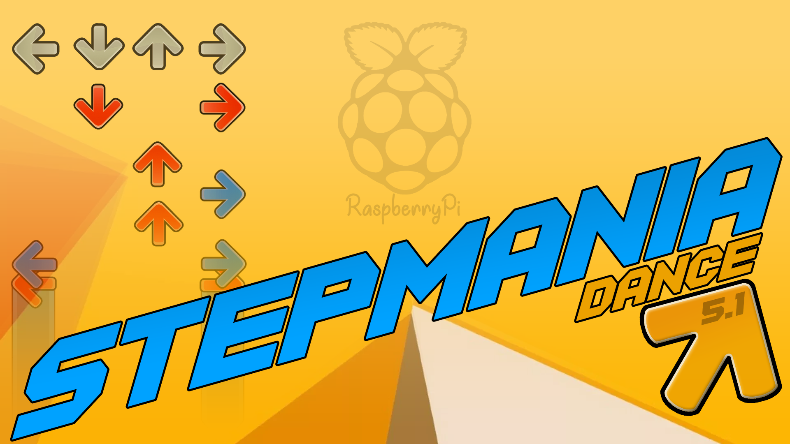

StepMania Arcade on Raspberry Pi
=========================

Scripts & instructions to turn a Raspberry Pi running Raspbian into a [StepMania](https://github.com/stepmania/stepmania) arcade console.

1. [Prerequisites](#prerequisites)
2. [Quick Start](#quick-start)
3. [Overclocking](#overclocking)
4. [USB Audio](#usb-audio)
5. [Controller Mapping](#controller-mapping)
6. [Notes](#notes)

Prerequisites
=========================

**You** must provide the following:

1. A supported [Raspberry Pi model](https://www.raspberrypi.org/products/)
	1. 3B
	2. 3B+
2. An installed & working [Raspbian](https://www.raspberrypi.org/downloads/raspbian/) operating system, Stretch (v9) or later.
3. A [USB sound card that works out-of-the-box with the Raspberry Pi](https://learn.adafruit.com/usb-audio-cards-with-a-raspberry-pi?view=all)
4. (Optional) A working StepMania binary for Raspberry Pi, on the `$PATH`

Quick Start
=========================

1. Clone this repository
2. Run `make`
3. Wait a bit
4. Reboot
5. Yay, StepMania automatically starts
6. (Optional) Run `make overclock-apply` for better performance

Now head down to the [USB Audio](#usb-audio) section if sound isn't coming out of your USB sound card.

Overclocking
=========================

_Required Reading: https://www.raspberrypi.org/documentation/configuration/config-txt/overclocking.md_

For optimal performance of this visually-demanding, timing-sensitive game, you should overclock the Raspberry Pi.

Included are two sets of overclock configuration that are slightly below the maximum stable overclock on **MY** Raspberry Pis.

They might work for yours, too. You can void your warranty and break the hardware on your Pi while overclocking.

I broke my Pi 3B by overlocking it too much, and it isn't stable anymore even with the overclocking configuration disabled.

To automatically apply included, probably-OK overclock settings and **VOID YOUR WARRANTY**, run

`make overclock-apply`

It will ask which Raspberry Pi you have. If you answer incorrectly you may end up installing overclock settings that will permanently ruin your Pi when you reboot.

`force_turbo` or not?
-------------------------

If your Raspberry pi will only ever be on when it is being used to run StepMania (as a true arcade console), you should set `force_turbo=1` in `/boot/config.txt`.

This will

1. Void the warranty
2. Cause the Pi to generate more heat than normal
3. Cause the Pi to consume more power than normal
4. Ensure the Pi is always running at peak performance

This is the default when using `make overclock-apply`.

If you just want to play StepMania on your Pi but it will frequently be turned on and _not_ running anything resource-intensive, you should _not_ set `force_turbo=1`.

You can run `make no-turbo` or edit `/boot/config.txt` by hand to remove any `force_turbo` lines.

Recovering From a Bad Overclock
-------------------------

If your Pi does not boot after applying overclock settings, or crashes shortly after booting,

1. Turn it off!
2. Get ready to press the "Shift" key.
3. Turn it on.
4. When the Raspberry on the white screen appears, press the "Shift" key.
5. Press `e` to edit the `config.txt`.
6. Scroll to the bottom and remove the lines that have to do with overclocking. Look in the [`performance-tune`](performance-tune) directory to see which options were added by this process.
7. Press `Esc` to boot and confirm that your Pi still works.
8. If you still want to overclock, proceed to the "Manual Overclocking" section below. Refer to the files in the `performance-tune` directory as upper limits, and stay below them.

Manual Overclocking
-------------------------

In case you want to twiddle the overclock settings by hand, here's a helpful chart.
The "Max stable" settings **WILL VARY BETWEEN DIFFERENT BOARDS** and are what I found were "just below" unstable on _my_ Pis.

### Raspberry Pi 3B

| Setting              | Default | Max Stable |
| -------------------- | ------- | ---------- |
| arm_freq             | 1200    | 1400       |
| core_freq            | 400     | 500        |
| sdram_freq           | 450     | 550        |
| over_voltage         | 0       | 3          |
| over_voltage_sdram   | 0       | 3          |

### Raspberry Pi 3B+

| Setting              | Default | Max Stable |
| -------------------- | ------- | ---------- |
| arm_freq             | 1400    | 1500       |
| core_freq            | 400     | 600        |
| sdram_freq           | 500     | 700        |
| over_voltage         | 0       | 3          |
| over_voltage_sdram   | 0       | 3          |

USB Audio
=========================

The Raspberry Pi uses its built-in headphone jack or the HDMI cable as the default sound output device.
The hardware that drives these is not very capable. StepMania's songs will sound scratchy.
To have good sound quality, you must use a USB sound card.

Getting this USB sound card working, and then working _as the default sound device_ can be hard.
Do yourself a favor and buy one that is known to work out-of-the-box with the Raspberry Pi.
Adafruit [sells one](https://www.adafruit.com/product/1475), or you can trust reviews on some other marketplace like Amazon.

Get USB Sound Working
-------------------------

Plug in your sound card. Use one or some combination of the following to try to activate it:

1. Raspbian GUI
2. `raspi-config`
3. `alsamixer`

At this point it's just a "how to get USB sound card working on Linux" problem.

* `dmesg` will show messages when you connect a USB device. Run `dmesg -w` and then plug the device in to watch it try to connect.
* `lsusb` will show connected USB devices.
* `aplay -l` will show recognized sound devices.

Make USB Sound the Default
-------------------------

This was probably already done by the [`usb-audio-by-default.conf`](system-prep/usb-audio-by-default.conf) modprobe configuration being installed by the `system-prep` target.
The key was to explicitly order all the devices, even the ones _you don't want and/or have blacklisted_, to ensure that USB is always "card 0".

If you find that your Pi does _not_ default to putting sound out through the USB sound card... you're on your own.

This is a great resource to start: https://raspberrypi.stackexchange.com/a/80075

Controller Mapping
=========================

On linux, the order that connected devices are listed is essentially random.
You're supposed to map devices to specific names, and use those names instead.
StepMania doesn't do this. It just reads the randomly-ordered device names.

If you have more than one dance pad or controller, sometimes StepMania will swap them around.
If these controllers are actually different devices and require different key mappings, this makes them not work.
You'd have to re-map the controllers through the "Options" menu every time StepMania started.

The included launch script offers a solution: You can put named key mapping files in StepMania's `Save/Keymaps/` directory for each controller you have.
The launch script will then figure out the order that StepMania sees your controllers and create a correct `Keymaps.ini` file for StepMania.

Your controllers will always be automatically mapped correctly.
In addition, the controllers will be assigned to P1 and P2 in alphabetical order, so you'll always have the same controller being the first (or "left") player.

Secondary Controllers
-------------------------

In the steps below, you'll create Keymap file for each of your controllers.
You may include primary _and_ secondary key mappings.

However, if you have more than 2 active controllers connected,
the _primary_ mappings for controllers 3 and 4 will be used as
the _secondary_ mappings of controllers 1 and 2, respectively.

Instructions
-------------------------

Here's how to set up named controller mappings:

1. [Map the Controller Normally](#map-the-controller-normally)
2. [Get the Controller Name](#get-the-controller-name)
3. [Create a Named Keymap File](#create-a-named-keymap-file)
4. [Prepare the Named Keymap](#prepare-the-named-keymap)
5. [Repeat](#repeat)

### Map the Controller Normally

1. Connect only one controller/pad
2. Reboot the machine
3. Start StepMania
4. Configure its key mappings through the "Options" menu, as the primary input for the primary controller

### Get the Controller Name

Run

	ls -hal /dev/input/by-id | grep event-joystick

To list all of your controllers and the `event` device they correspond to.

If you have multiple controllers connected, you should see somethign like

	usb-0079_USB_Gamepad-event-joystick -> ../event1
	usb-©Microsoft_Corporation_Controller_05B30D7-event-joystick -> ../event2
	usb-Sony_PLAYSTATION_R_3_Controller-event-joystick -> ../event4

Identify the controller you care about. For example, if the PS3 controller is the one, that's `event4`.

Now run

	udevadm info /dev/input/event4 | awk -F'=' '/ID_SERIAL=(.*)/{print $2}'

To print out the device's "serial ID." In this case it was `Sony_PLAYSTATION_R_3_Controller`.

### Create a Named Keymap File

Create the directory `~/.stepmania-5.1/Save/Keymaps` if it doesn't already exist. You can do this by running

	mkdir -p ~/.stepmania-5.1/Save/Keymaps

In that directory, create a file for the controller, named `<PRIORITY>-<CONTROLLER_NAME>.ini`.

The "priority" determines which controller gets to be the first player or "left" dance pad, if there are multiple active controllers connected.

To make the PS3 controller always the main/left/P1 controller, create `0-Sony_PLAYSTATION_R_3_Controller.ini`.

Copy the contents of StepMania's `Keymaps.ini` into that file.

### Prepare the Named Keymap

StepMania's `Keymaps.ini` file might look like this:

	[dance]
	1_Back=Joy11_B17
	1_Coin=
	1_Down=Joy11_B2
	1_EffectDown=
	1_EffectUp=
	1_Left=Joy11_B3
	1_MenuDown=
	1_MenuLeft=
	1_MenuRight=
	1_MenuUp=
	1_Operator=
	1_Right=Joy11_B4
	1_Screenshot=
	1_Select=
	1_Start=Joy11_B18
	1_Up=Joy11_B1
	1_UpLeft=
	1_UpRight=
	2_Back=Joy12_B7
	2_Coin=
	2_Down=Joy12_B2
	2_EffectDown=
	2_EffectUp=
	2_Left=Joy12_B1
	2_MenuDown=
	2_MenuLeft=
	2_MenuRight=
	2_MenuUp=
	2_Operator=
	2_Right=Joy12_B4
	2_Screenshot=
	2_Select=
	2_Start=Joy12_B8
	2_Up=Joy12_B3
	2_UpLeft=
	2_UpRight=

That isn't what needs to be in a single controller's keymap file.

After copying the contents of a working `Keymap.ini` into a controller's keymap file, do the following:

1. Remove the `[dance]` line
2. Delete all lines that start with `2_`
3. Delete all lines that don't have anything on the right of the `=`
4. Change all `Joy1X_` mappings to `Joy10_`

For the PS3 controller, it would look like this:

`~/.stepmania-5.1/Save/Keymaps/0-Sony_PLAYSTATION_R_3_Controller.ini`:

	1_Back=Joy10_B17
	1_Down=Joy10_B2
	1_Left=Joy10_B3
	1_Right=Joy10_B4
	1_Start=Joy10_B18
	1_Up=Joy10_B1

### Repeat

Do this again for each controller you want to use.
Make sure no other controllers are connected while you're setting each one up.
When you're done, you can test it by running `~/.stepmania-5.1/launch.sh`.
You should see a printout something like this:

	==========
	Sony_PLAYSTATION_R_3_Controller connected?
	  Yes: at Joy10. Will be P1.
	
	==========
	0079_USB_Gamepad connected?
	  Yes: at Joy12. Will be P2.
	
	==========
	©Microsoft_Corporation_Controller_05B30D7 connected?
	  Yes: at Joy11. Will be P1 secondary.
	
	==========
	Controller_Controller_Controller connected?
	  Yes: at Joy13. Will be P2 secondary.

Notes
=========================

1. [Make Targets](#make-targets)
2. [Performance Benchmarks](#performance-benchmarks)
3. [Building for Other Raspberry Pi Models](#building-for-other-raspberry-pi-models)

Make Targets
-------------------------

The intended use of this `Makefile` is

1. `make`
2. `make overclock-apply`

If you _want_ to do some of the tasks individually, they are:

### `make system-prep`

1. Configure `/boot/config.txt` with non-overclock settings (including enabling OpenGL)
2. Prepare to use USB audio

### `make stepmania-install`

1. Install StepMania for Raspberry Pi

### `make arcade-setup`

1. Set up StepMania to start automatically on login.
2. Set some StepMania `Preferences.ini` settings.

### `make overclock-apply`

Allow applying probably-OK (but warranty-voiding) overclock settings to the Raspberry Pi, for improved StepMania performance.

### `make no-turbo`

Remove the `force_turbo=1` setting from `/boot/config.txt`.

Use this if you expect the Pi to be turned on and NOT running StepMania for significant periods of its life.

Performance Benchmarks
-------------------------

### Rasbperry Pi 3B

| Screen Resolution | Texture Size | Overclocked? | Framerate |
| ----------------- | ------------ | ------------ | --------- |
| 1280 x 720        | 512          | Yes          | 45        |

### Rasbperry Pi 3B+

| Screen Resolution | Texture Size | Overclocked? | Framerate |
| ----------------- | ------------ | ------------ | --------- |
| 1680 x 1050       | 512          | No           | 32        |
| 1680 x 1050       | 512          | Yes          | 37        |
| 1680 x 1050       | 1024         | Yes          | 33        |

StepMania Version
-------------------------

By default, if `stepmania` is not present on your Pi's `$PATH`
this will install a pre-compiled StepMania binary from [`SpottyMatt/stepmania-raspi-deb`](https://github.com/SpottyMatt/stepmania-raspi-deb/releases).

If you want to set up a different version of StepMania as an arcade console (with no guarantees that these scripts will work with your chosen version),
just make sure that version is installed and on your `$PATH` before running `make`.

There are some variables you can provide to `make` to help increase the chances of successfully working with a different StepMania:

| Variable         | Purpose                                            |
| ---------------- | -------------------------------------------------- |
| `SM_INSTALL_DIR` | The directory that contains the `stepmania` binary |
| `SM_CONFIG_DIR`  | The directory that contains StepMania settings     |
| `SM_BINARY_URL`  | Location of a StepMania `.deb` binary to install   |

For example, to use with StepMania 5.2:

	make SM_CONFIG_DIR=~/.stepmania-5.2 SM_INSTALL_DIR=/usr/local/stepmania-5.2
